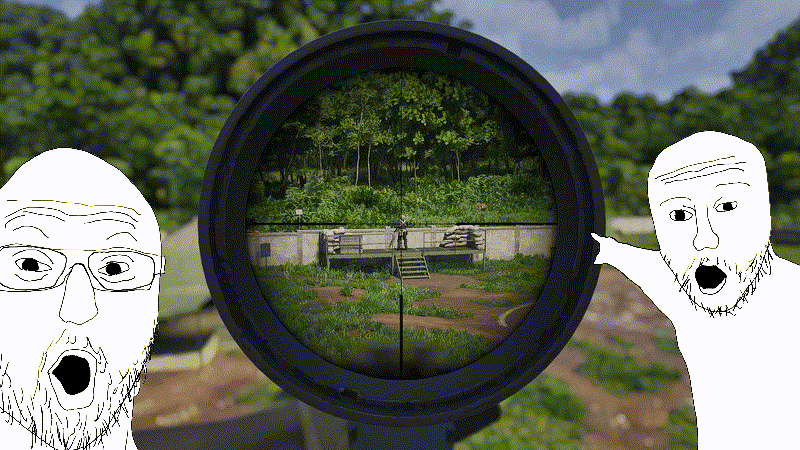

   <h1>DigitalScope</h1>

A lightweight real time screen magnifier overlay for Windows that lets you zoom in on the center of your screen

   

## Features

- Real time screen magnifier overlay 
- Adjustable zoom level and window size
- Click through window, so it does not block mouse input
- Hotkey toggle for quick on/off

## Installation

### Windows
1. Go to the [Releases](https://github.com/PawelKawka/DigitalScope/releases) page.
2. Download `DigitalScope_Setup.exe`.
3. Run the installer and follow the instructions.
4. Launch the app via the Desktop shortcut or Start Menu.

> [!WARNING]
> #### Windows SmartScreen
> Because this project is free and open source the installer does not come with a digital certificate. Windows may display a SmartScreen message when you first run it.

> [!WARNING]
>**Author takes no responsibility for any game bans, account suspensions or other consequences** that may result from using this software while playing online games.  
>Some anticheats perform broad behavioural analysis and may flag or react to overlay tools even if they do not interact with game memory. 
>**Use at your own risk** always check the terms of service of the game you are playing.

## About
- Developed by Pawel Kawka.
- Open Source and free to use.

